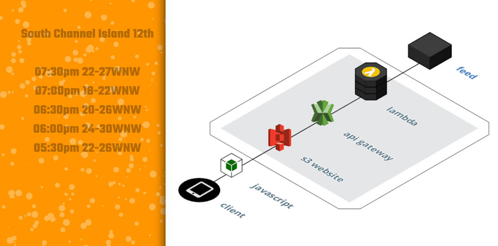

kitesurf.craiggunson.com
===================


serverless kitesurfing windspeed app using javascript, HTML5/Canvas, api-gateway, lambda   


##### See buildspec.yml

1. Use AWS CodeBuild or (manual) use deploy commands from inside.
2. update kite.js like so...

```
$.get({
  url: "https://yourapi.execute-api.ap-southeast-2.amazonaws.com/Stage/wind",
```

pic



